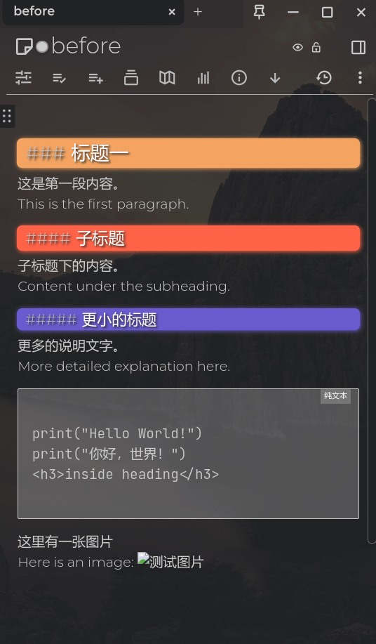
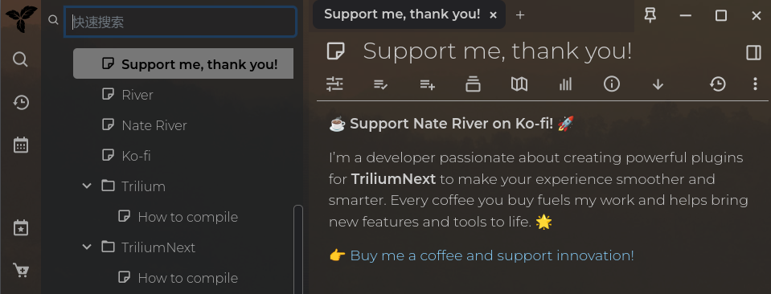
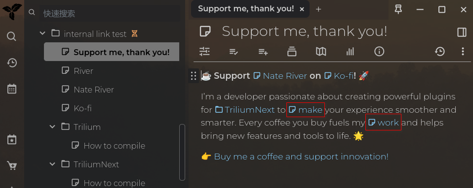
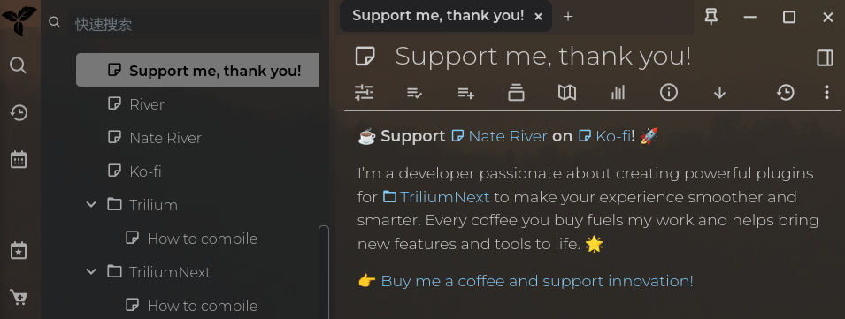
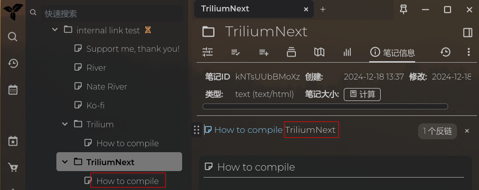

# 🐍 trilium-py

<p align="center">
English | <a href="README_CN.md">简体中文</a>
</p>

Python client for Trilium Note's ETAPI and Web API, with additional advanced features :)

[](https://pepy.tech/project/trilium-py)
[](https://pypi.org/project/trilium-py)
[](https://pypi.org/project/trilium-py)
[](https://pypi.python.org/pypi/trilium-py/)
[](https://GitHub.com/Naereen/StrapDown.js/graphs/commit-activity)

## 🦮 Table of Contents

<!--ts-->
* [🐍 trilium-py](#-trilium-py)
   * [🦮 Table of Contents](#-table-of-contents)
   * [🔧 Installation](#-installation)
   * [🚀 Initialization](#-initialization)
      * [ETAPI initialization](#etapi-initialization)
      * [Web API initialization](#web-api-initialization)
   * [📖 (Basic) ETAPI Usage](#-basic-etapi-usage)
      * [📊 Application Information](#-application-information)
      * [🔍 Search note](#-search-note)
      * [🏭 Create Note](#-create-note)
         * [🖼️ Create Image note](#️-create-image-note)
      * [👀 Get note](#-get-note)
      * [🔄 Update note](#-update-note)
      * [🗑️ Delete note](#️-delete-note)
      * [📄 Create note clone/branch](#-create-note-clonebranch)
      * [🔍 Get note clone info](#-get-note-clone-info)
      * [✏️ Modify note clone info](#️-modify-note-clone-info)
      * [❌ Delete note clone](#-delete-note-clone)
      * [📅 Day note](#-day-note)
      * [📤 Export note](#-export-note)
      * [📥 import note](#-import-note)
      * [💾 Save revision](#-save-revision)
      * [💾 Create data backup](#-create-data-backup)
      * [🏷 Create attribute](#-create-attribute)
      * [Get attachment list](#get-attachment-list)
      * [Get attachment info](#get-attachment-info)
      * [Update attachment info](#update-attachment-info)
      * [Get attachment content](#get-attachment-content)
      * [Update attachment content](#update-attachment-content)
      * [Create attachment](#create-attachment)
   * [(Advanced Usage) ✅ TODO List](#advanced-usage--todo-list)
      * [Add TODO item](#add-todo-item)
      * [Check/Uncheck a TODO item](#checkuncheck-a-todo-item)
      * [Update a TODO item](#update-a-todo-item)
      * [Delete a TODO item](#delete-a-todo-item)
      * [Move yesterday's unfinished todo to today](#move-yesterdays-unfinished-todo-to-today)
   * [(Advanced Usage) 🚚 Upload Markdown files](#advanced-usage--upload-markdown-files)
      * [Upload single Markdown file with images](#upload-single-markdown-file-with-images)
      * [Disable math formula parsing](#disable-math-formula-parsing)
      * [Bulk upload Markdown files in a folder](#bulk-upload-markdown-files-in-a-folder)
         * [Import from VNote](#import-from-vnote)
         * [Import from Joplin](#import-from-joplin)
         * [Import from Logseq](#import-from-logseq)
         * [Import from Obsidian](#import-from-obsidian)
         * [Import from Youdao Note/有道云笔记](#import-from-youdao-note有道云笔记)
         * [Import from Turtl](#import-from-turtl)
         * [Import from other markdown software](#import-from-other-markdown-software)
         * [Disable math formula parsing for folder import](#disable-math-formula-parsing-for-folder-import)
   * [(Advanced Usage) 🎨 Beautify notes](#advanced-usage--beautify-notes)
      * [Beautify a note](#beautify-a-note)
      * [Beautify a note and its child notes](#beautify-a-note-and-its-child-notes)
   * [(Advanced Usage) 🧹 Sort note content](#advanced-usage--sort-note-content)
   * [(Advanced Usage) 🧹 Delete empty new note](#advanced-usage--delete-empty-new-note)
   * [(Advanced Usage) 🗜️ Optimize image size](#advanced-usage-️-optimize-image-size)
   * [(Advanced Usage) 🔗 Automatically Add Internal Links](#advanced-usage--automatically-add-internal-links)
      * [Example](#example)
      * [Excluding Notes from Internal Linking](#excluding-notes-from-internal-linking)
      * [Special Case: Duplicate Titles](#special-case-duplicate-titles)
      * [Final Rule: No Self-Linking](#final-rule-no-self-linking)
      * [Code Samples](#code-samples)
   * [(Advanced Usage) 📝🌳 Traverse Note Tree](#advanced-usage--traverse-note-tree)
   * [(Advanced Usage) 🗓️🔁 Periodic TODOs](#advanced-usage-️-periodic-todos)
   * [(Basic) Web API Usage](#basic-web-api-usage)
      * [📣 Share note &amp; cancel share note](#-share-note--cancel-share-note)
   * [🛠️ Develop](#️-develop)
   * [🔗 Original OpenAPI Documentation](#-original-openapi-documentation)
* [💰 Donation](#-donation)
* [🙏 Thanks](#-thanks)
<!--te-->

## 🔧 Installation

```bash
python3 -m pip install trilium-py --user
```

## 🚀 Initialization

In the following code example, `ea` stands for ETAPI, and `wa` stands for Web API. Please perform the corresponding
initialization process based on whether you need to use the ETAPI or the Web API.

### ETAPI initialization

If you have a ETAPI token, change the `server_url` and `token` to yours.

```python
from trilium_py.client import ETAPI

server_url = 'http://localhost:8080'
token = 'YOUR_TOKEN'
ea = ETAPI(server_url, token)
```

If you haven't created ETAPI token, you can create one with your password. Please note, you can only see this token
once, please save it if you want to reuse the token.

```python
from trilium_py.client import ETAPI

server_url = 'http://localhost:8080'
password = '1234'
ea = ETAPI(server_url)
token = ea.login(password)
print(token)
```

After initialization, you can use Trilium ETAPI with python now.

### Web API initialization

You need to login every time you use the web API due to the CSRF limit.

```
from trilium_py.src.trilium_py.web_client import WEBAPI

server_url = 'http://localhost:8080'
password = '1234'
wa = WEBAPI(server_url)
wa.login(password)
```

After initialization, you can use Trilium web API with python now.

## 📖 (Basic) ETAPI Usage

These are basic function that Trilium's ETAPI provides. Down below are some simple example code to use this package.

### 📊 Application Information

To start with, you can get the application information like this.

```python
print(ea.app_info())
```

It should give you the version of your server application and some extra information.

### 🔍 Search note

Search note with keyword.

```python
res = ea.search_note(
    search="python",
)

for x in res['results']:
    print(x['noteId'], x['title'])
```

Search with regular expression. For example, search and get all child notes under certain note:

```python
res = ea.search_note(
    # regular expression search for note title
    search="note.title %= '.*'",
    ancestorNoteId="Parent Note ID",
    fastSearch=False,
    orderBy=["title"],
    limit=100,
)
```

Note: `limit` will not work without `orderBy`.

### 🏭 Create Note

You can create a simple note like this.

```python
res = ea.create_note(
    parentNoteId="root",
    title="Simple note 1",
    type="text",
    content="Simple note example",
    noteId="note1"
)
```

The `noteId` is not mandatory, if not provided, Trilium will generate a random one. You can retrieve it in the return.

```python
noteId = res['note']['noteId']
```

#### 🖼️ Create Image note

Image note is a special kind of note. You can create an image note with minimal information like this. The `image_file`
refers to the path of image.

```python
res = ea.create_image_note(
    parentNoteId="root",
    title="Image note 1",
    image_file="shield.png",
)
```

### 👀 Get note

To retrieve the note's content.

```python
ea.get_note_content("noteid")
```

You can get a note metadata by its id.

```python
ea.get_note(note_id)
```

### 🔄 Update note

Update note content

```python
ea.update_note_content("noteid", "updated by python")
```

Modify note title

```python
ea.patch_note(
    noteId="noteid",
    title="Python client moded",
)
```

### 🗑️ Delete note

Simply delete a note by id.

```python
ea.delete_note("noteid")
```

### 📄 Create note clone/branch

In the ETAPI, this is called a branch, but in the Trilium UI it represents a note clone.

Here is an example to create a clone of `note2` under `note1`.

```
res = ea.create_branch(
    noteId="note2",
    parentNoteId="note1",
)
```

It will return the note clone info like this:

```
{
    'branchId': 'note1_note2',
    'noteId': 'note2',
    'parentNoteId': 'note1',
    'prefix': None,
    'notePosition': 10,
    'isExpanded': False,
    'utcDateModified': '2025-10-21T03:25:16.397Z'
}
```

### 🔍 Get note clone info

Retrieve details about a specific note clone (branch) by its branchId

```
res = ea.get_branch(branchId="note1_note2")
```

### ✏️ Modify note clone info

Update an existing note clone’s display attributes such as prefix, position, or expansion state

```
res = ea.patch_branch(branchId="note1_note2", notePosition=0, prefix="patched", isExpanded=False)
```

### ❌ Delete note clone

Remove a note clone (branch) from the tree.

```
res = ea.delete_branch(branchId="note1_note2")
```

### 📅 Day note

You can get the content of a certain date with `get_day_note`. The date string should be in format of "%Y-%m-%d", e.g. "
2022-02-25".

```python
ea.get_day_note("2022-02-25")
```

Then set/update a day note with `set_day_note`. The content should be a (html) string.

```python
ea.set_day_note(date, new_content)
```

### 📤 Export note

Export note comes in two formats `html` or `markdown`/`md`. Setting `noteId` to `root` will export all notes.

```python
res = ea.export_note(
    noteId='sK5fn4T6yZRI',
    format='md',
    save_path='/home/nate/data/1/test.zip',
)
```

### 📥 import note

This is the built-in feature in trilium. The input file should be a zip file.

```python
res = ea.import_note(
    noteId='sK5fn4T6yZRI',
    file_path='/home/nate/data/1/test.zip',
)
```

### 💾 Save revision

Save note revision manually.

```
res = ea.save_revision(
    noteId='MJzyFRXAVaC9',
)
```

### 💾 Create data backup

This example will create a database backup file like this `trilium-data/backup/backup-test.db`.

```python
res = ea.backup("test")
```

You can use the cron utility in Linux to schedule regular automatic backups. For example, to set up a daily backup at 3:
00 AM, you would use the following cron expression:

```bash
0 3 * * * python /path/to/backup-script.py
```

### 🏷 Create attribute

You can create a tag for a note

```python
res = ea.create_attribute(
    noteId='noteid',
    type='label',
    name='name_of_the_tag',
    value='value_of_the_tag',
    isInheritable=True
)
```

The `noteId` is not mandatory, if not provided, Trilium will generate a random one. You can retrieve it in the return.

```python
noteId = res['note']['noteId']
```

### Get attachment list

Get all attachments of a single note.

```
res = ea.get_attachments('uMJt0Ajr1CuC')
```

### Get attachment info

Get image title and etc.

```python
res = ea.get_attachment('Y5V6pYq6nwXo')
```

### Update attachment info

Change image title and etc.

```python
res = ea.update_attachment(
    attachmentId='2b7pPzqocS1s', title='hello etapi', role='image', mime='image/png'
)
```

### Get attachment content

Get the real image file

```python
res = ea.get_attachment_content('icpDE4orQxlI')
with open('1.png', 'wb') as f:
    f.write(res)
```

### Update attachment content

Replace the image with new one

```python
res = ea.update_attachment_content('icWqV6zFtE0V', '/home/nate/data/1.png')
```

### Create attachment

Upload a image file as attachment of a note.

```python
res = ea.create_attachment(
    ownerId='8m8luXym5LxT',
    file_path='/home/nate/data/ksnip_20230630-103509.png',
)
```

## (Advanced Usage) ✅ TODO List

With the power of Python, I have expanded the basic usage of ETAPI. You can do something with todo list now.

### Add TODO item

You can use `add_todo` to add a TODO item, param is the TODO description

```python
ea.add_todo("买暖宝宝")
```

### Check/Uncheck a TODO item

param is the index of the TODO item

```python
ea.todo_check(0)
ea.todo_uncheck(1)
```

### Update a TODO item

Use `update_todo` to update a TODO item description at certain index.

```python
ea.update_todo(0, "去码头整点薯条")
```

### Delete a TODO item

Remove a TODO item by its index.

```python
ea.delete_todo(1)
```

### Move yesterday's unfinished todo to today

As the title suggests, you can move yesterday's unfinished things to today. Unfinished todo's will be deleted from
yesterday's note.

```python
ea.move_yesterday_unfinished_todo_to_today()
```

## (Advanced Usage) 🚚 Upload Markdown files

### Upload single Markdown file with images

You can import Markdown file with images into Trilium now! Trilium-py will help you to upload the images and fix the
links for you!

```python
res = ea.upload_md_file(
    parentNoteId="root",
    file="./md-demo/manjaro 修改caps lock.md",
)
```

### Disable math formula parsing

When uploading Markdown files that contain dollar signs ($) which are not meant to be interpreted as math formulas, you
can disable the math formula parsing:

```python
res = ea.upload_md_file(
    parentNoteId="root",
    file="./md-demo/document_with_dollar_signs.md",
    parse_math=False,  # Disable math formula parsing
)
```

### Bulk upload Markdown files in a folder

You can upload a folder with lots of Markdown files to Trilium and preserve the folder structure!

#### Import from VNote

Say, upload all the notes from [VNote](https://github.com/vnotex/vnote), simply do this:

```python
res = ea.upload_md_folder(
    parentNoteId="root",
    mdFolder="~/data/vnotebook/",
    ignoreFolder=['vx_notebook', 'vx_recycle_bin', 'vx_images', '_v_images'],
)
```

#### Import from Joplin

Joplin can be imported effortlessly.

```python
res = ea.upload_md_folder(
    parentNoteId="root",
    mdFolder="/home/nate/data/joplin_data/",
    ignoreFolder=['_resources', ],
)
```

#### Import from Logseq

```python
res = ea.upload_md_folder(
    parentNoteId="root",
    mdFolder="/home/nate/data/logseq_data/",
    ignoreFolder=['assets', 'logseq'],
)
```

#### Import from Obsidian

Obsidian has a very unique linking system for files. You should use [obsidian-export
](https://github.com/zoni/obsidian-export) to convert a Obsidian vault to regular Markdown files. Then you should be
able to import the note into Trilium with trilium-py.

Convert it first.

```bash
obsidian-export /path/to/your/vault /out
```

Then import just like a normal markdown, trilium-py will handle the images for you.

```python
res = ea.upload_md_folder(
    parentNoteId="root",
    mdFolder="E:/data/out",
)
```

#### Import from Youdao Note/有道云笔记

Youdao does not provide an export feature anymore. Luckily, you can use <https://github.com/DeppWang/youdaonote-pull> to
download your notes and convert them into markdown files. After that, trilium-py should be able to help you import them.

```python
res = ea.upload_md_folder(
    parentNoteId="root",
    mdFolder="/home/nate/gitRepo/youdaonote-pull/out/",
)
```

#### Import from Turtl

You need to convert Turtl from json to markdown first.
See [turtl-to-markdown](https://github.com/Nriver/trilium-py/tree/main/examples/turtl-to-markdown) for details.

Then you can import with trilium-py like this:

```python
res = ea.upload_md_folder(
    parentNoteId="root",
    mdFolder="/home/nate/gitRepo/turtl-to-markdown/out/",
    ignoreFolder=['_resources'],
)
```

#### Import from other markdown software

In general, markdown files have variety of standards. You can always try import them with

```python
res = ea.upload_md_folder(
    parentNoteId="root",
    mdFolder="/home/nate/data/your_markdown_files/",
)
```

If there is any problem, please feel free to create an [issue](https://github.com/Nriver/trilium-py/issues/new).

#### Disable math formula parsing for folder import

Similarly, you can disable math formula parsing when importing a folder of Markdown files:

```python
res = ea.upload_md_folder(
    parentNoteId="root",
    mdFolder="~/data/financial_documents/",
    parse_math=False,  # Disable math formula parsing for all files in the folder
)
```

## (Advanced Usage) 🎨 Beautify notes

Because of the constraints imposed by the library utilized by Trilium, imported notes may experience minor formatting
problems. These issues include an additional line appearing at the end of code blocks, images becoming integrated with
the note content, and the absence of line breaks between headings, resulting in a cramped appearance of the note
content.

When collecting information, some notes copied from the **web**, saved via **clipping plugins**, or imported from *
*other applications** may contain redundant line breaks, inconsistent heading levels, or messy formatting, making them
look cluttered.

Beautify notes will automatically cleans up unnecessary content, normalizes headings and paragraph layouts, and makes
your notes cleaner, clearer, and easier to read.



Here is what you can do to beautify your note.

### Beautify a note

Specify a note id to beautify note content.

```python
ea.beautify_note('krm8B9JthNfi')
```

### Beautify a note and its child notes

```python
ea.beautify_sub_notes('tlPuzU2szLJh')
```

## (Advanced Usage) 🧹 Sort note content

Sort a note by the heading names. This feature could prove invaluable for notes containing extensive lists, such as book
titles sorted into various genres. It's equally useful for managing browser bookmarks or collecting links.

Additionally, you have the option to specify a language code for sorting based on your local language. This enhances the
sorting process and tailors it to your linguistic preferences.

```python
res = ea.sort_note_content('lPxtkknjR2bJ')
res = ea.sort_note_content('y6hROhWjNmHQ', 'zh_CN.UTF-8')
```

## (Advanced Usage) 🧹 Delete empty `new note`

Sometimes I inadvertently create numerous "new notes" which remain undeleted within my note tree. These "new notes"
clutter my
workspace, scattered across various locations. I made this bulk deletion of these empty "new notes." Additionally, it
generates warning messages for "new notes" that contain content, maybe we should change the title for those notes.

```python
ea.delete_empty_note()
```

## (Advanced Usage) 🗜️ Optimize image size

Try to reduce image size by using PIL's optimize feature. If the image in your note is not compressed, you can try this.
I've successfully convert a note of 44MB to 9.9MB after this process. Backup your data before try this.

The default quality is set to 90.

`optimize_image_attachments` will keep the original image format and try to compress it.

```
ea.optimize_image_attachments('uMJt0Ajr1CuC')
```

To save even more space, you can try the following method.

The `optimize_image_attachments_to_webp` function converts images to the `WebP` format, significantly reducing file
sizes. Based on my experience, `WebP` images can be as little as 25% to 50% of the size of `PNG` images.

```
ea.optimize_image_attachments_to_webp('H2q3901uFDCH')
```

This action can save significant space if you have many clipped pages. Whoever invented `WebP` is a genius.

## (Advanced Usage) 🔗 Automatically Add Internal Links

This feature allows you to automatically create internal links within your notes. Let’s take a look at how it works.

### Example

Here is a sample note:



After running a single line of code:

```python
auto_create_internal_link('put_note_id_here')
```

The note transforms into this:



As you can see, some text has been replaced with internal links. The feature follows these rules:

- **Title Match**: Content that matches any other note's title is replaced with an internal link.
- **Duplicate Titles Ignored**: If multiple notes share the same title, no link is created for that title.
- **Longer Matches First**: Longer titles take precedence. For example, in the above example, "Nate River" is linked,
  not just "River."
- **Existing Links Remain**: Pre-existing links in the text are left untouched.

However, some words like "make" and "work" in the example are part of my "English Words That I Do Not Know" note. Since
they are common and frequently used, I don’t want them to create excessive internal links.

### Excluding Notes from Internal Linking

To prevent certain notes from being linked:

- Add the tag `#ignoreAutoInternalLink` to a note. This note (and optionally its sub-notes) will be excluded from link
  creation.
- You can make it **inheritable**—you can apply it to a parent note and inheritable, then it will be automatically
  exclude all its sub-notes.

Here’s how it looks after applying the exclusion rule:



The result is cleaner and more intentional.

### Special Case: Duplicate Titles

When multiple notes share the same title, a specific condition allows for internal links:

- **Direct Sub-Notes Have Priority**: Direct child notes take precedence over other notes with the same title.

For instance:



In this case, the note `TriliumNext` links "How to compile" to its own child note, not the one from `Trilium`.

### Final Rule: No Self-Linking

A note will never create an internal link to itself.

---

### Code Samples

**Add an internal link to a specific note by its ID:**

```python
auto_create_internal_link('gLmmsIM8yPqx')
```

**Add internal links for multiple notes:**

```python
auto_create_internal_link(target_notes=['gLmmsIM8yPqx', 'T4Ui3wNByO03'])
```

**(Experimental - Use with Caution)**
**Add internal links to all text notes:**

This is an experimental feature. **Backup your database** before using it, as it may irreversibly modify your notes. If
issues occur, please provide a minimal note sample to help debug.

```python
auto_create_internal_link(process_all_notes=True)
```

## (Advanced Usage) 📝🌳 Traverse Note Tree

Fetch a note's title and content along with its descendants'. Great for reassembling large notes split into smaller
child notes.

The method can be `bfs` or `dfs`.

```python
res = ea.traverse_note_tree('XdOlGz7MeYWC', depth=3, limit=100, method='bfs')
for x in res:
    logger.info(x)
```

## (Advanced Usage) 🗓️🔁 Periodic TODOs

You can use add_periodic_todos to automatically add recurring tasks (daily, weekly, monthly, yearly).
If a task is due today and not already in today’s TODO list, it will be added automatically.

```python
periodic_todos = [
    # Stretch body every day
    {"content": "Stretch body", "type": "daily"},

    # Buy milk for Nriver every day :)
    {"content": "Buy milk for Nriver :)", "type": "daily"},

    # Wash clothes on every Saturday
    {"content": "Wash clothes", "type": "weekly", "weekday": 6},

    # Write monthly report on the first day of every month
    {"content": "Write monthly report", "type": "monthly", "day": 1},

    # Pay rent on the last day of every month
    {"content": "Pay rent", "type": "monthly", "day": -1},

    # Buy anti-allergy medicine on the 10th of every month
    {"content": "Buy anti-allergy medicine", "type": "monthly", "day": 10},

    # Annual review every year on December 31
    {"content": "Annual review", "type": "yearly", "month": 12, "day": 31},

    # Happy new year on January 1 :)
    {"content": "Happy new year :)", "type": "yearly", "month": 1, "day": 1},
    
    # Pay bills on the 15th of every month until 2077-01-01
    {"content": "Pay bills", "type": "monthly", "day": 15, "end_date": "2077-01-01"},

    # Team meeting every Monday starting from 2025-01-01
    {"content": "Team meeting", "type": "weekly", "weekday": 1, "start_date": "2025-01-01"},

    # Special project from 2025-09-26 to 2025-09-30
    {"content": "Work on special project", "type": "daily", "start_date": "2025-09-26", "end_date": "2025-09-30"},
]

ea.add_periodic_todos(periodic_todos)
```

## (Basic) Web API Usage

These features are made based on the web API from Trilium's web client. Be sure you have done
the [initialization](#web-api-initialization) before use it.

### 📣 Share note & cancel share note

```python
wa.share_note('your_note_id')
wa.cancel_share_note('RfhYrtyQLU8o')
```

## 🛠️ Develop

Install with pip egg link to make package change without reinstall.

```python
python -m pip install --user -e .
```

## 🔗 Original OpenAPI Documentation

The original OpenAPI document is [here](https://github.com/zadam/trilium/blob/master/src/etapi/etapi.openapi.yaml). You
can open it with [swagger editor](https://editor.swagger.io/).

# 💰 Donation

If you enjoy using **Trilium-py**, your support would mean a lot!

**Ko-fi**
[](https://ko-fi.com/nriver)

**Alipay**


**WeChat Pay**


# 🙏 Thanks

Thanks `Matt Wilkie` for donating 10.0 USD!
